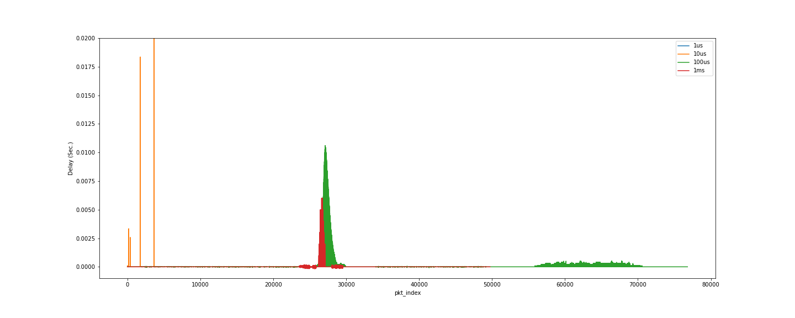

# TSN-EndSystem
The ultra-low latency periodic Ethernet communication based on Linux

## 1. Introduction

## 2. Testbed Setup

### 2.1 Equipments

- 2 * [Network Adapter(NIC) with Intel I210 Controller](https://www.amazon.com/ipolex-Single-Port-Gigabit-Ethernet-Converged/dp/B0728289M7/ref=sr_1_4?crid=1RXZWJCF4YJG0&keywords=i210&qid=1663721874&sprefix=i210%2Caps%2C138&sr=8-4) 
- 2 * Dell Linux Station 
- 1 * Ethernet CAT8 Cable

There are several reasons that we choose i210 NIC that you can find in the following links:

- [LaunchTime function](https://en.wikipedia.org/wiki/Launch_Time)
- [Faster with PCIe than DMA](https://forums.evga.com/Intel-NICs-i219-and-i210-on-X299-Dark-m2820935.aspx)
- [Receive Side Scaling (RSS)](https://blog.kylemanna.com/hardware/intel-nic-igb-i211-vs-e1000e-i219/)

### 2.2 Environment

### 2.2.1 Install igb driver for i210 NIC

Step 1: Download igb-5.11.4.tar.gz [here](https://www.intel.com/content/www/us/en/download/14098/intel-network-adapter-driver-for-82575-6-82580-i350-and-i210-211-based-gigabit-network-connections-for-linux.html).

Step 2: Install the igb driver following the link [here](https://downloadmirror.intel.com/738737/readme.txt).

Some potential issues:

- igb driver only supports for specific Linux kernels. During my test that Linux 5.4.0 and Linux 5.17.0 worked normally but 5.14.0 and 5.15.0 failed with GPF error in kernel logs and system got totally freezen. Some related issues can be found at [here](https://bugs.archlinux.org/task/65113).
- igb driver may occur some error when you install both e1000e driver and igb on same kernel. The reason I guess is e1000e also drives for I210 as a general driver but lacks of several functions.

### 2.3 Set up Linux Qdisc ETF Scheduler

The ETF (Earliest TxTime First) qdisc allows applications to control the instant when a packet should be dequeued from the traffic control layer into the netdevice, which makes it possible to schedule packets in a periodic manner.

Step 1: Configuring the ETF Qdisc following the link [here](https://tsn.readthedocs.io/qdiscs.html#configuring-the-etf-qdisc).

Some potential issues:

- The wrong configuration for delta parameter might crush down the socket program. It must bound the delay from user space and should be estimated for different machines. This delta parameter must be account into the socket program for scheduling periodic traffic.

Several materials might be helpful:

- [tc-etf man page](https://man7.org/linux/man-pages/man8/tc-etf.8.html)
- [Qdisc ETF source code](https://lkml.org/lkml/2017/9/18/76)
- [Qdisc TSN offload]( https://github.com/xdp-project/xdp-project/blob/master/areas/tsn/code01_follow_qdisc_TSN_offload.org)

### 2.4 Periodic Socket Programming

We use Qdisc ETF scheduler to schedule traffic into a periodic manner and use linux HARDWARE timestamp to record the delay in MAC layer.

Step 1: Run sche.c on talker and recv.c on listener. The sending time and receiving time in HW and SW timestamp will output through terminal on both talker and listener.

Step 2: Record those output data and calculate the round-trip delay.

Note:

- 2 different functions defined in `utils.h`. 
  - `sche_single` is scheduled with ETF scheduler.
  - `send_single` is scheduled in C program (application level).

- Parameters:
  - `TIME_DELTA` that has to be adapted with the delay you estimated in Sec 2.3.
  - `DEFAULT_PRIORITY` that has to be adapted with the qdisc configuration you have done in Sec 2.3.
  -  `BUFFER_LEN` is the length of UDP payload.
  - `HW_FLAG` should be set as 1 to record HW timestamp.

Materials can be found at:

- [Source code](https://github.com/ChuanyuXue/TSN-EndSystem/tree/main/src).
- [Linux Kernal Archives: HW timestamp](https://www.kernel.org/doc/Documentation/networking/timestamping.txt).

## 3. Experiment Result

**Delay comparision**

**Jitter comparision**

**Throughput comparision**

Note: It is clear to see that some packets are lost or delayed when frequency is high for sigel traffic.

More results can be found in the data folder.

## 4. Future work
- Determining the cause of the ETF scheduler's inability to support high bandwidth. Its inability to enable out-of-order scheduling could be one of the causes. For instance, packet $f 1$ is planned to transmit at time $t 3$ at time $t 1$ while packet $f 2$ is scheduled to send at time $t_4$ at time $t_2$. When $t_2$ > $t_1$ and $t_4$ < $t_3$, the system crashes.

- Discover a method to support a single traffic with a frequency of 200000Hz that satisfies the following conditions: :
  - No packet loss.
  - Delay is bounded within 1us.
  - Jitter (the time gap between two neighbor packet) is constrained within 1us.
  
  Instead of purely using the ETF scheduler, you are allowed to experiment with other strategies like DPDK or OpenFlow.

- Find a means to accommodate more traffic in multiple periods simultaneously, such as three traffics with periods of 50000Hz, 30000Hz, and 70000Hz; ideally, the overall frequency should be greater than 100000 Hz.

